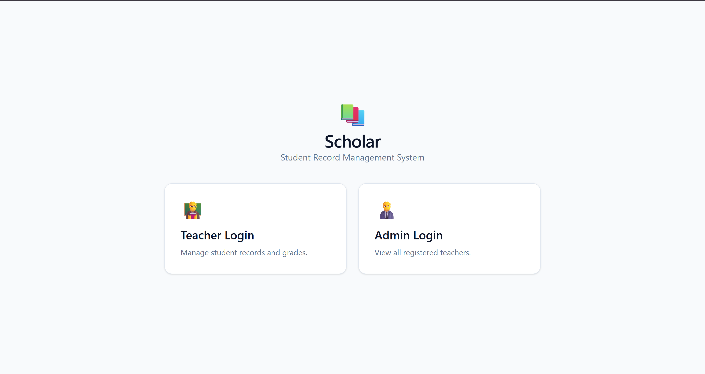
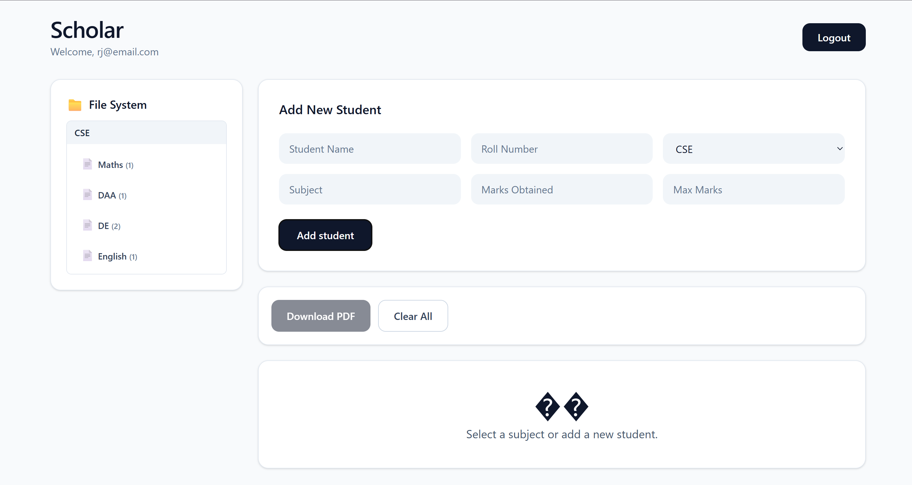
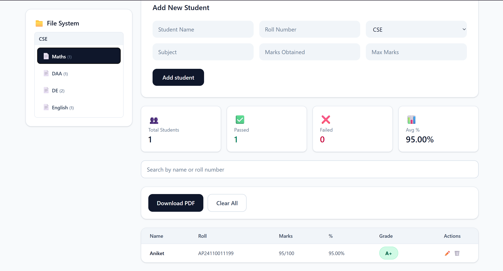
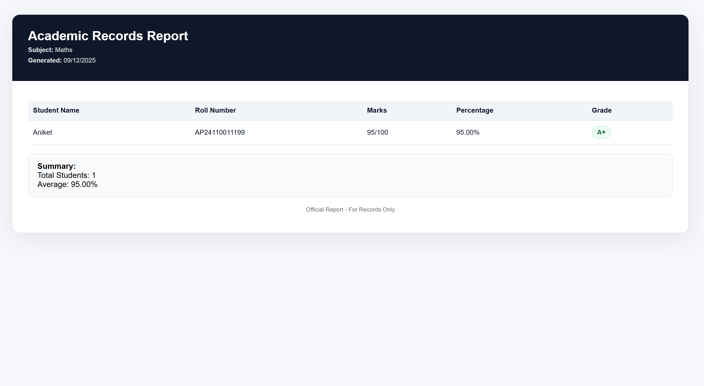
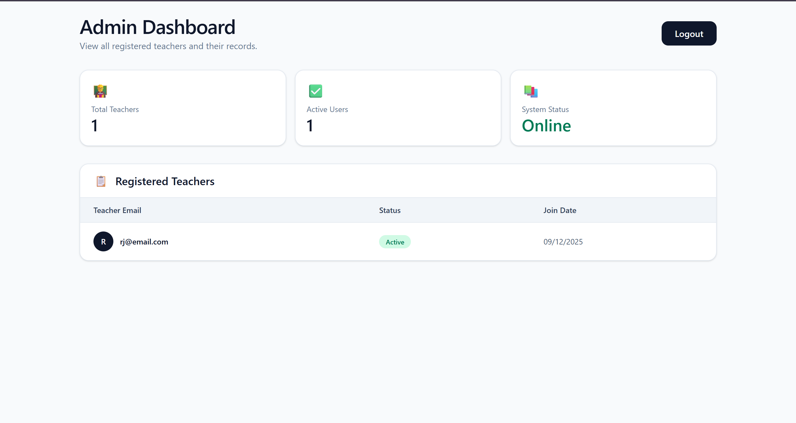

# 📚 Scholar - Student Record Management System

## 🌐 Live Demo

🚀 **[View Live Demo](https://your-demo-url.vercel.app)** 

> 💡 **Quick Start**: Try the admin dashboard with `admin@scholar.com` / `admin123` or create a teacher account to explore full features.

---

## 🎯 Overview

**Scholar** is a modern, feature-rich student record management system built with **Vite + React + Tailwind CSS**. It provides an intuitive interface for teachers to manage student records, calculate grades automatically, and generate professional PDF reports. An admin dashboard allows administrators to monitor all registered teachers.

---

## 📸 Screenshots

### 🏠 Home - User Type Selection

*Choose between Teacher Login or Admin Login to get started*

### 👨‍🏫 Teacher Portal

*Complete dashboard with file system navigation, student management, and real-time statistics*

### 📝 Student Records Management

*Add, edit, delete, and search student records with automatic grade calculation*

### 📄 PDF Report Generation

*Professional PDF reports with student details, grades, and summary statistics*

### 👨‍💼 Admin Dashboard

*Monitor all registered teachers, view system statistics, and manage user accounts*

---

## ✨ Key Features

### 🔐 **Authentication System**
- **Teacher Registration & Login** - Create secure teacher accounts
- **Admin Dashboard** - View all registered teachers
- **Session Management** - Secure user sessions with logout functionality
- **Demo Admin Account** - `admin@scholar.com` / `admin123`

### 📁 **File System Organization**
- Hierarchical folder structure: **Branch → Subject → Students**
- Organized data storage for easy navigation
- Automatic cleanup of empty folders
- Real-time file structure updates

### 👨‍🏫 **Teacher Dashboard**
- Add, edit, and delete student records
- Manage multiple subjects across different branches
- Real-time statistics and performance metrics
- Search functionality for quick student lookup

### 📊 **Grade Management**
- Automatic grade calculation based on marks
- Support for custom max marks (50, 100, 200, etc.)
- Percentage calculation with 2 decimal precision
- Grade scale:
  - **A+**: 90-100%
  - **A**: 80-89%
  - **B+**: 70-79%
  - **B**: 60-69%
  - **C**: 50-59%
  - **D**: 40-49%
  - **F**: Below 40%

### 📄 **PDF Report Generation**
- Professional PDF reports with gradient headers
- Student details, marks, percentages, and grades
- Summary statistics (total students, average percentage)
- Print-ready format
- Color-coded grades for visual clarity

### 📈 **Analytics & Statistics**
- Total students count
- Pass/Fail ratio
- Average percentage calculation
- Real-time metrics for selected subject
- Filter by subject and branch

### 🎨 **Modern UI/UX**
- Dark theme with indigo-pink gradient design
- Smooth animations and transitions
- Responsive design (mobile, tablet, desktop)
- Glassmorphism effects
- Beautiful card-based layouts

### 👨‍💼 **Admin Features**
- View all registered teachers
- Monitor system status
- Teacher activity tracking
- System information dashboard
- Security status monitoring

---

## 🛠️ Technology Stack

```
Frontend Framework: React 18+ (with Hooks)
Build Tool: Vite
Styling: Tailwind CSS
State Management: React useState
Storage: Browser localStorage
PDF Generation: HTML + Print API
```

---

## 📦 Installation & Setup

### Prerequisites
- Node.js (v14 or higher)
- npm or yarn package manager

### Step 1: Create Vite Project
```bash
npm create vite@latest scholar -- --template react
cd scholar
```

### Step 2: Install Dependencies
```bash
npm install
```

### Step 3: Install Tailwind CSS
```bash
npm install tailwindcss @tailwindcss/vite
```

### Step 4: Configure Tailwind (tailwind.config.js)

### Step 5: Add Tailwind Directives (src/index.css)
```css
@import "tailwindcss";

```

### Step 6: Copy the Application Code
Replace the contents of `src/App.jsx` with the Scholar application code.

### Step 7: Run the Development Server
```bash
npm run dev
```

The application will be available at `http://localhost:5173`

---

## 🚀 How to Use

### 1️⃣ **Initial Login Screen**
- Launch the application
- You'll see two options: **Teacher Login** or **Admin Login**
- Click on your desired option

### 2️⃣ **Teacher Workflow**

#### Registration
1. Click "Teacher Login"
2. Click "Sign up" link
3. Enter email and password
4. Confirm password and click "Create Account"
5. Log in with your credentials

#### Adding Students
1. Fill in all required fields:
   - **Student Name**: Full name of the student
   - **Roll Number**: Student ID/Roll Number
   - **Branch**: Select from CSE, ECE, EEE, MECH, CIV, EE
   - **Subject**: Name of the subject (e.g., Data Structures, Algorithms)
   - **Marks Obtained**: Student's marks (must be ≤ Max Marks)
   - **Max Marks**: Total marks for the assessment
2. Click "➕ Add Student"
3. Record is saved to file system automatically

#### Managing Records
- **File System Panel** (Left Side):
  - Shows all branches as folders
  - Shows all subjects under each branch
  - Click on a subject to view its students
  - Shows count of students per subject

- **Search Students**:
  - Use search bar to filter by name or roll number
  - Results update in real-time

- **Edit Student**:
  - Click "✏️" button in the student row
  - Modify details in the form
  - Click "💾 Update" button

- **Delete Student**:
  - Click "🗑️" button in the student row
  - Student record is removed immediately

#### Downloading Reports
1. Click on a subject to view students
2. Click "📄 Download PDF" button
3. Review the generated report in the print preview
4. Click "Print" to save as PDF or print

#### Statistics
- **👥 Total Students**: Count of students in selected subject
- **✅ Passed**: Students with ≥40% marks
- **❌ Failed**: Students with <40% marks
- **📊 Average %**: Average percentage across all students

### 3️⃣ **Admin Workflow**

#### Admin Login
1. Click "Admin Login"
2. Enter credentials:
   - **Email**: `admin@scholar.com`
   - **Password**: `admin123`
3. Click "Admin Login"

#### Admin Dashboard Features
- **📊 Statistics Cards**:
  - Total Teachers registered
  - Active users count
  - System status

- **📋 Teachers List**:
  - View all registered teacher emails
  - Status indicator (🟢 Active)
  - Join date
  - Professional table format

- **🔒 Security Section**:
  - Database status
  - Encryption status
  - Session status

- **ℹ️ System Info**:
  - Platform version
  - Last updated date
  - System information

---


## 🔒 Security Features

✅ Secure password storage in localStorage
✅ Session-based authentication
✅ Teacher data isolation (each teacher sees only their records)
✅ Admin access restriction
✅ Input validation on all forms
✅ Confirmation dialogs for destructive actions

---


## ⚡ Performance Optimization

- Lazy state updates
- Memoized calculations
- Efficient search filtering
- Optimized re-renders with React hooks
- Minimal bundle size with Vite

---


## 📝 Project Structure

```
scholar/
├── public/                    # Static assets
├── src/
│   ├── assets/               # Images and static resources
│   ├── data/
│   │   └── db.js            # IndexedDB database layer
│   ├── App.jsx              # Main application component
│   ├── App.css              # Component styles
│   ├── index.css            # Global styles with Tailwind imports
│   └── main.jsx             # Application entry point
├── .gitignore               # Git ignore rules
├── eslint.config.js         # ESLint configuration
├── index.html               # HTML template
├── package.json             # Dependencies and scripts
├── package-lock.json        # Dependency lock file
├── README.md                # Project documentation
└── vite.config.js           # Vite build configuration
```

---

##  Contributing

Feel free to fork, modify, and enhance this project!

---

## 📄 License

This project is open-source and available under the MIT License.


